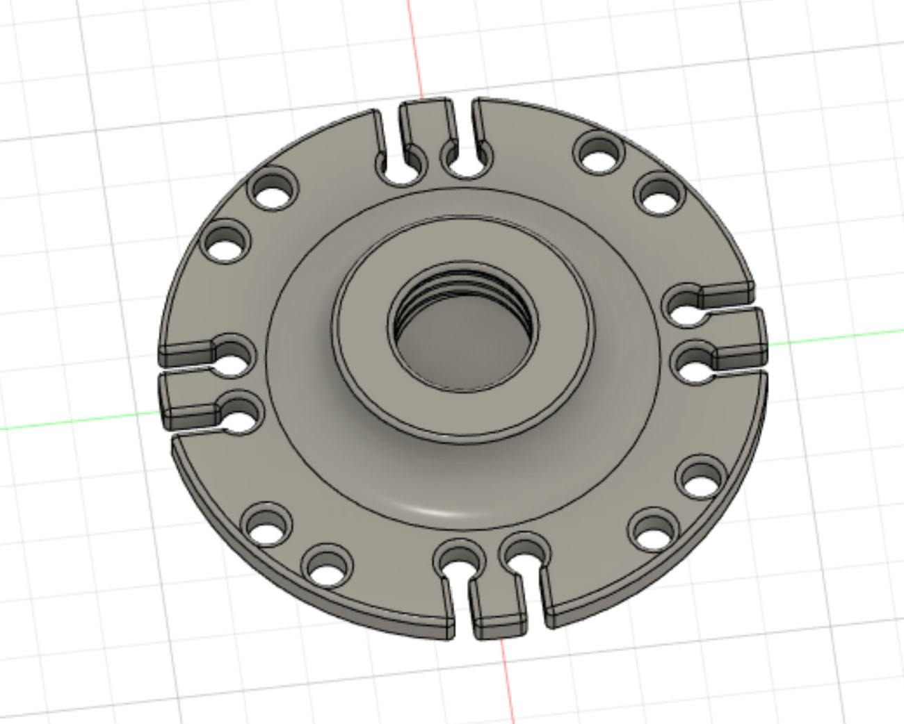
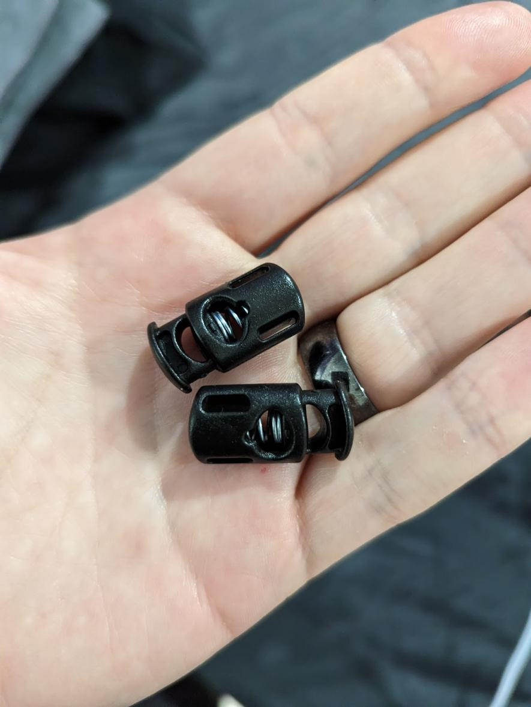
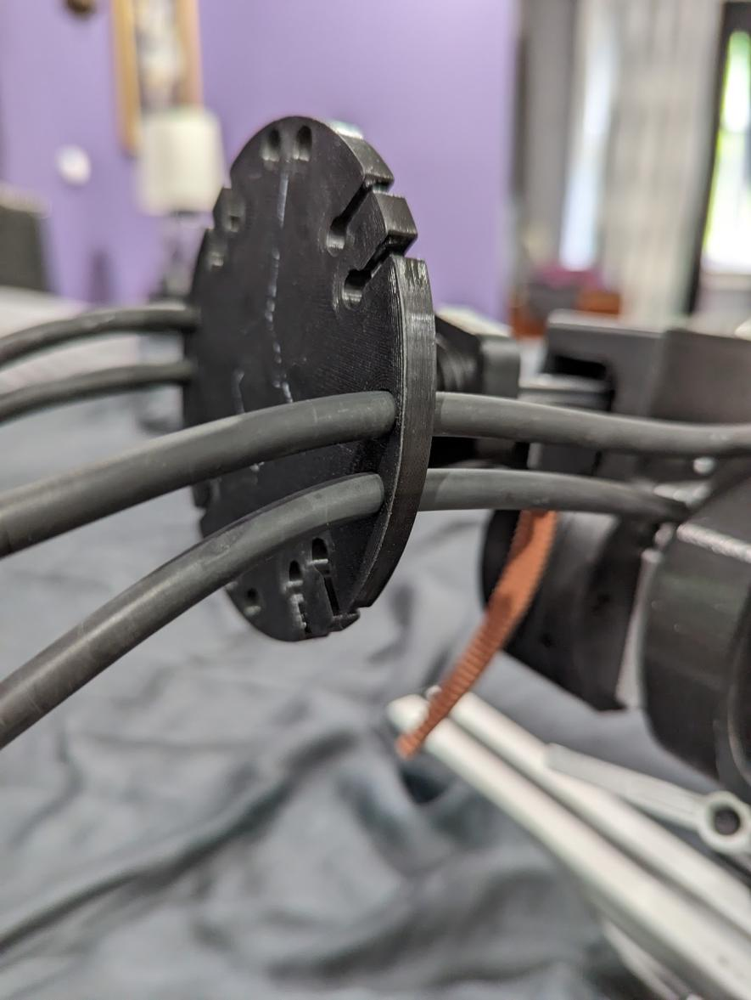
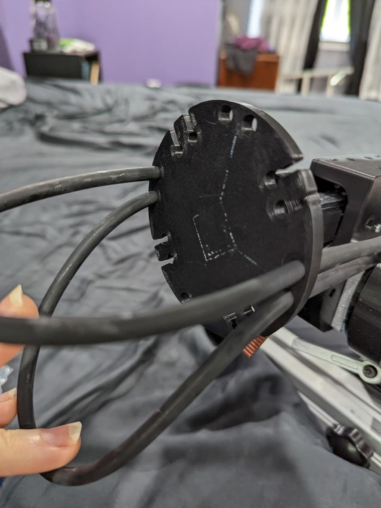

# A larger tie down

The tiedown that came with the OSSM kit from research and desire was not large enough to fit many of the toys that we have, so I remixed the tie down. This version is larger and has deeper grooves so the tie does not slip. There are also embedded holes that keep toys in place extremely well.

I also wanted a more hygienic solution as rope was next to impossible to clean. 
The holes perfectly accomodate latex tubing which makes strapping a toy down very easy. Spring toggles help to keep the latex tube in place. Both are very common and easy to get and cheap!

[Latex Rubber Tubing Tube - 1/8" (3mm) ID x 1/4" (6mm) OD](https://www.amazon.com/dp/B0BCNWQMXG/ref=pe_830710_114784790_TE_n_id?th=1)  

[Plastic Cord Locks Single Hole Spring Toggle Stopper - 27x15mm(Length * Width), Hole diameter: 8mm](https://www.amazon.com/dp/B08JTZPQRY/ref=pe_830710_114784790_TE_n_id?th=1)

  

[With toy attached](./PXL_20230520_143826769.jpg)

