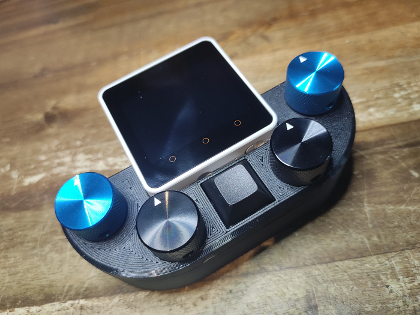

# Upgrade projects

These projects act as a total upgrade to the OSSM experience.

[The OSSM M5 Remote](https://github.com/ortlof/OSSM-M5-Remote) is a fantastic wireless controller upgrade that really allows you to dial in the settings. You can purchase a kit, or a premade version directly from Vampix (a.k.a. Ortlof) in the #m5-remote discord channel or you can build it yourself.

Photo credit Ortlof